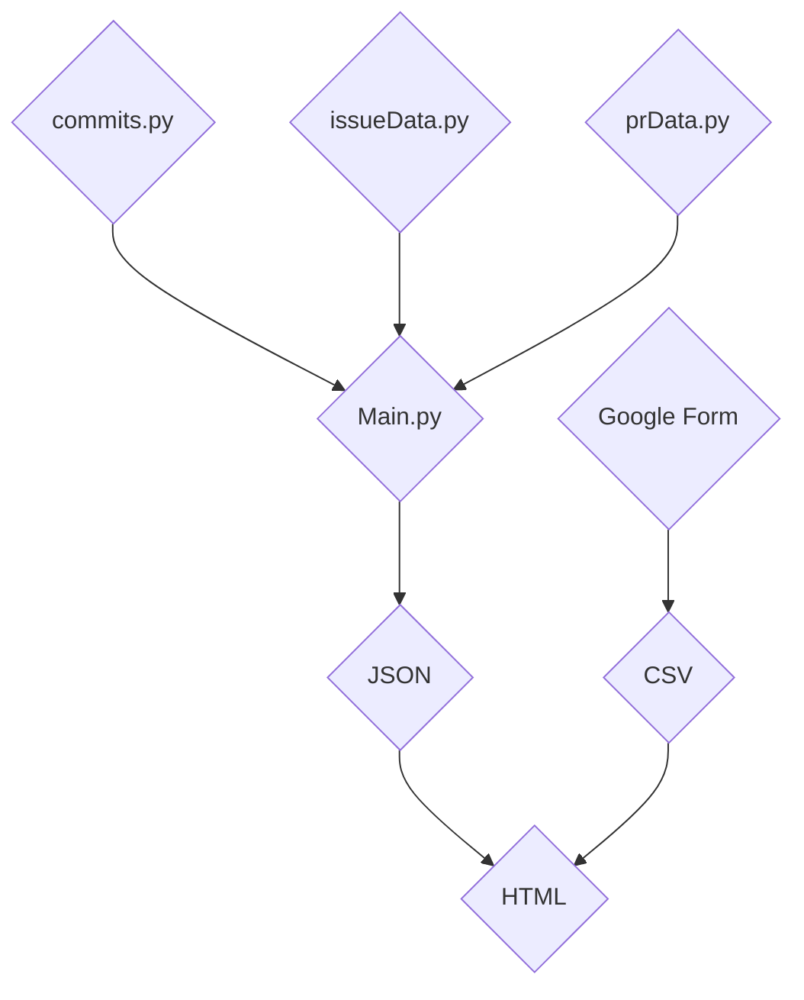

## Components

### 1. Data Collection
Scripts gather data from multiple sources:
- **commits.py** — retrieves commit frequency, lead/cycle time, and delivery metrics from Git logs.
- **issueData.py** — collects issue data including open/closed frequency and resolution time.
- **prData.py** — extracts pull request data such as merge time and WIP.
- **Google Form Responses** — captures team and client satisfaction metrics via CSV export.

### 2. Processing Layer
- **main.py** merges all datasets, computes metrics, and outputs results to JSON and CSV for visualization.

### 3. Dashboard
- The frontend (HTML/JS) visualizes metrics using charts (GET MORE INFO FROM JOLI).

### 4. Data Flow Summary
1. Data is collected from GitHub via GitPy and the Google Form sent at the end of each sprint.
2. `main.py` processes and normalizes the data.
3. Outputs are stored in structured CSV/JSON.
4. Dashboard consumes processed data for visual reporting.

